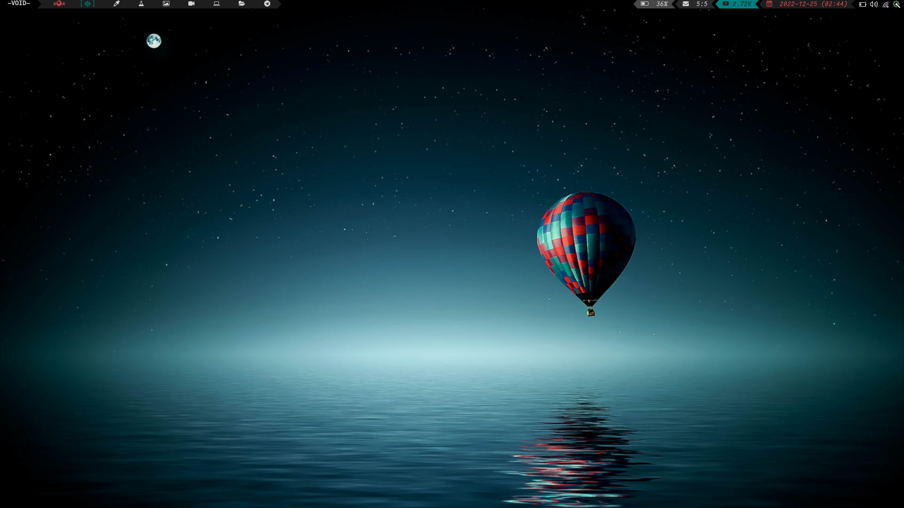

# My personal configuration and setup of HerbstluftWM
### This uses polybar, but also has the option of using xmobar

#### The configuration is broken up into several files
* Autostart (main file)
* keys (keybindings)
* winrules (window rules)
* Herbstluft themes (directory with different themes that can be selected via a script)
* Polybar themes (dir with polybar themes files to go with different themes selected)
* Main polybar config
* Wallpapers
* Updicon script for systray update icon
* Xmobar files
